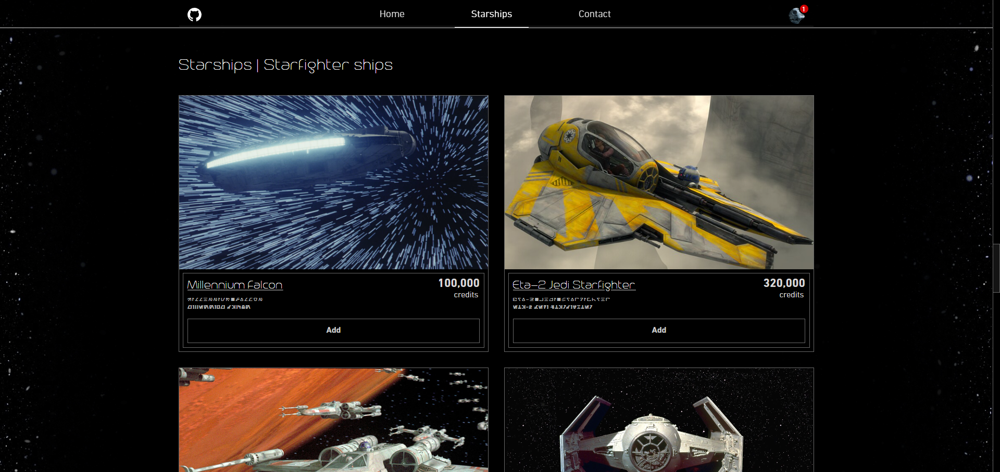

<h1 align='center'>Star Wars Shipyard</h1>

<h2>Live</h2>

🔥 [Live](https://star-wars-shipyard.netlify.app/)

<h2>Implementation</h2>

- React SPA using React Router
- CSS Modules
- React Testing Library
- Type Checking With PropTypes
- React's Context API
- Custom hooks

 

<h2>Features</h2>

- Star Wars Shipyard e-commerce store with a catalog of starships from the Star Wars universe.
- Data collected thanks to [Star Wars Databank API](https://starwars-databank.vercel.app/) and [SWAPI API](https://swapi.dev/).
- Pick between 3 starship categories for any and all space travel needs.
- Starship image, details and characteristics all in one place.
- Shopping cart with shipping discount.
- Contact us personally or fill out our forms for standardized communication.
- Responsive design.

 

<h2>Screenshots</h2>

<h3>Desktop</h3>

<h3>Mobile</h3>

 